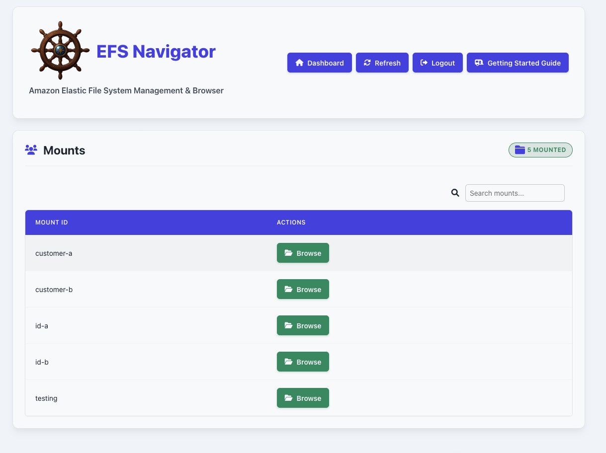
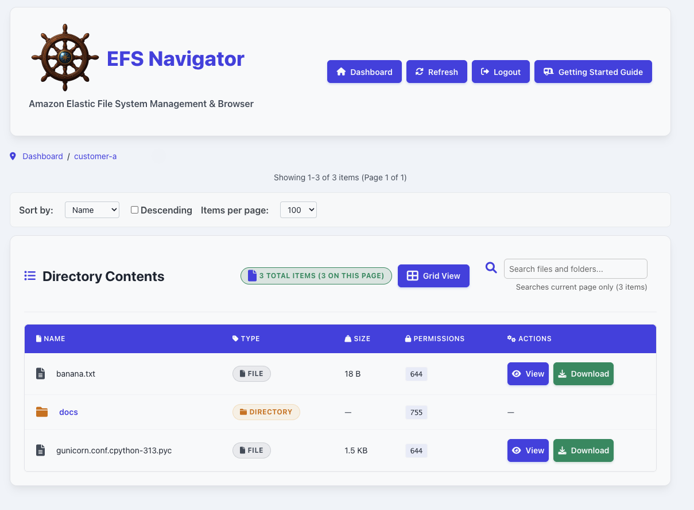
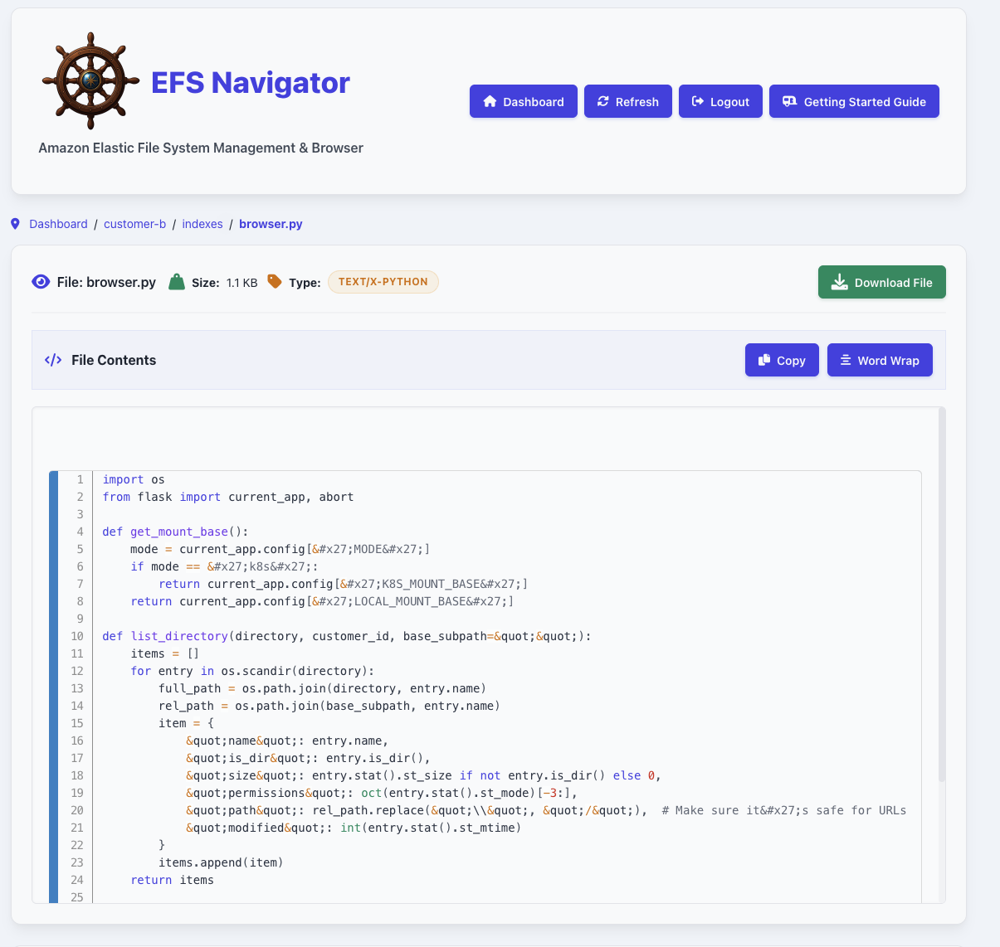

# EFS Navigator
A lightweight web-based interface for exploring AWS EFS Access Points.

EFS Navigator lets you securely browse, view, and download files stored on Amazon EFS. With support for syntax highlighting of common file types (YAML, Python, Bash, and more), it’s a handy tool for DevOps engineers and platform teams working with shared cloud storage.

## Overview
The front page dashboard shows each EFS Access Point as a directory referenced in the `Mount ID` column. Clicking the `Browse` button will open up the Access Point and begin file navigation.

Once in an access point, sub-directories and files can be viewed. Clicking on the file or directory at this point will proceed with the navigation or view the file if its `MIME Type` can be viewed in the tool. If a file cannot be opened by the application, it's automatically downloaded. Otherwise, clicking on the `Download` button will download the file.

You can view files with supported MIME types in the browser. 

> [!IMPORTANT]
> The EFS Navigator application never modifies the actual file stored in EFS. For security reasons, when displaying some file content in the browser, certain characters (like quotes or angle brackets) are converted to HTML entities in the browser (e.g. `'` appears as `&#x27;`). This is to prevent malicious code execution.

## Authentication
At this time only OAuth and no authentication (development mode) are supported. Refer to the [Getting Start Guide](./docs/GETTING_STARTED_GUIDE.md) for more information on OAuth and general setup.

