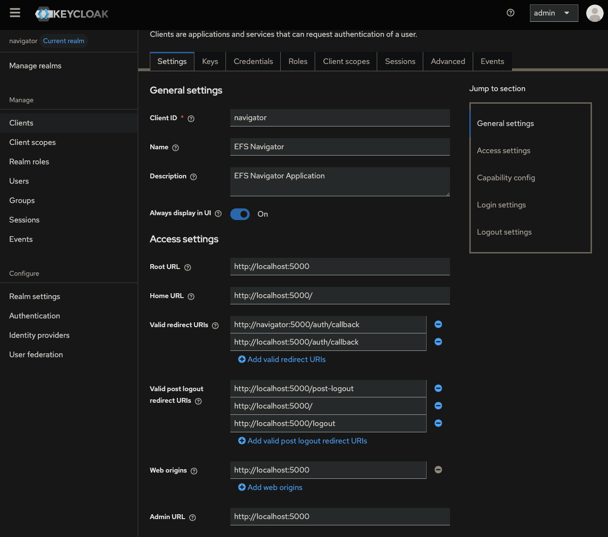

# Getting Started Guide

## Prerequisites
- Python 3.12+
- Git
- Access to AWS EFS (mounted or mountable)

## Quick Start (Development)
1. Clone and setup:
```sh
git clone https://github.com/thatsnotamuffin/efs-navigator
cd efs-navigator
python3 -m venv venv
source venv/bin/activate
pip install -r requirements.txt
```
2. Configure environment
```sh
export MODE=development
export MOUNT_BASE=/path/to/your/efs/mount
export SECRET_KEY=CHANGEME
```
3. Run
```sh
python run.py
```

## Local Development with OAuth in Production mode
**Local Keycloak Configuration:** Below is a screenshot of a local `keycloak` Client configuration


A `docker-compose.yml` is provided that starts `keycloak` and `postgres 15` containers for OAuth use. The `keycloak` container needs to be built first for postgres compatibility and is referenced in the `docker/` directory of this repository. This `docker-compose.yml` is configured for local development.

You can start the application using `Docker Compose` with the following commands:
```sh
docker compose run --rm keycloak build --db=postgres
docker compose up -d
```

## Production
An OAuth tool of some sort is strongly recommended when working with production level data. Any OAuth tool should work so long as a `Client ID` and `Client Secret` are able to be generated. At the moment only `Keycloak` has been tested.

When setting the enviroment variable `MODE` to `production`, OAuth setup is required. See the below environment variables for more information.

```sh
LOG_LEVEL=INFO # This can also be set to DEBUG - WARN - ERROR
MODE=production # Application running environment. Valid values are production - development
SECRET_KEY=CHANGEME # Self generated secret key for flask
MOUNT_BASE=/path/to/your/efs/mount # Mount directory
OAUTH_METADATA_URL=https://your.oauth.tool/metadata/url # OAuth Metadata URL
OAUTH_CLIENT_ID=your-client-id # Generated OAuth Client ID
OAUTH_CLIENT_SECRET=1234CLIENT5678SECRET # Generated OAuth Client Secret
OAUTH_SCOPE="some scope here" # OAuth scope
OAUTH_LOGOUT_URL=https://your.oauth.tool/logout # OAuth logout URL
```

Using `gunicorn` you can start the application with `gunicorn -c gunicorn.conf.py wsgi:app`.

**NOTE:** Using a `.env` file is possible but strongly discouraged for production use.

## Server Setup (Optional)
See the [Server Setup](./server_setup.md) for more information on installing EFS Navigator on a Linux `Ubuntu 22.04` server.

## Gotchas 
A potential gotcha is a local networking issue in Production mode when testing with `MODE=production` using the `docker-compose.yml` at the root of this repository. You may see this error below:

```sh
Error during authentication: mismatching_state: CSRF Warning! State not equal in request and response.
```

A possible fix is to add this to your local `/etc/hosts`: `localhost keycloak`
